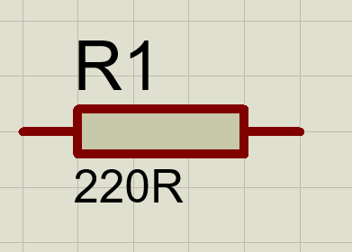

# Circuito en Serie - Simulación y analisis en Proteus
Los circuitos en Serie forman una parte fundamental de las aplicaciones de energia eléctrica en la era moderna. Las principales aplicaciones de circuitos en Serie, se llevan a cabo bajo la corriente continua, tipo de corriente mas utilizada para diversas aparatos tecnologicos actuales, sin embargo, su presición y utilidad es de suma importancia para comprender los fundamentos de los circuitos electricos.

En esta investigación, se investiga bajo la herramienta de Software Proteus, para analizar circuitos en serie bajo la implementación de resistores, realizando mediciones de tensión, corriente y potencia en el circuito. Su comportamiento bajo condiciones extremas es fundamental para determinar su uso en la actualidad, conocer hasta donde puede llegar un circuito en serie, comparte una necesidad extrema para implementar determinantes necesarios para la evolución de las fallas y su continua operación.

Para el presente analisis, se define una resistencia para proyectar en el circuito en serie (corriente continua).

